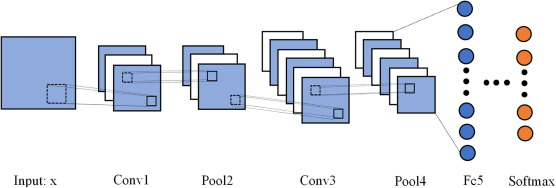

# Deep Learning Model for Car Parts Classification

## This project handles car parts classification using a deep learning model built with PyTorch. The model is trained to distinguish between 50 distinct car parts.

Key Technologies:

 * PyTorch: Deep learning framework for model development.

 * Matplotlib & Pandas: Data visualization and manipulation libraries.

 * NumPy: For computation purposes.

## Visual Explanation + Non-Visual

Introduction:
This project aims to classify different parts of cars using Convolutional Neural Networks (CNN). With the help of the Kaggle dataset, we'll train our model to recognize 50 distinct car parts.

Architecture Overview:
The architecture of our CNN model consists of two main blocks. These blocks are designed to extract features from the input images and learn the patterns associated with each car part. After training for 100 epochs, the model is expected to achieve an accuracy ranging from 70% to over 90%.

Dataset Link: https://www.kaggle.com/datasets/gpiosenka/car-parts-40-classes

## How to get this
To use this model, follow these simple steps:

1. Download the Kaggle dataset containing images of car parts.
2. Install the necessary libraries and dependencies.
3. Train the model by running the provided script with appropriate configurations.
4. After training, evaluate the model's performance using test data.

## How to tweak this project for your own use 

This project requires a timeline and could achieve up to 100% accuracy by leveraging existing large language models and customizing them for this dataset. 
Alternatively, one could simply take photos of their car parts and enjoy predicting them for fun, with the potential for perfect accuracy (:

## find a bug?

Submit please if you find something (:

